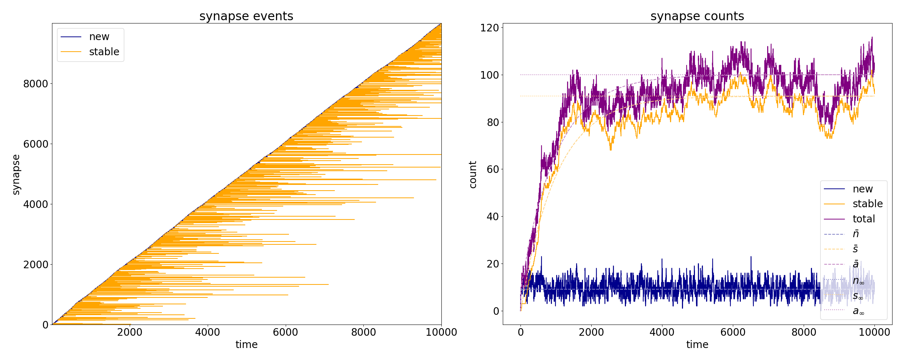
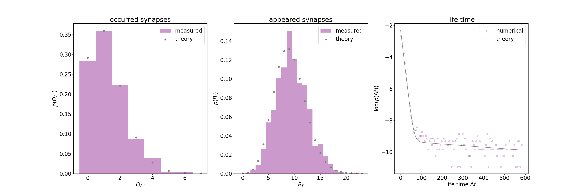

# Developmental Synapse Remodeling

[**](https://github.com/ChristophKirst/developmental_synapse_remodeling/license.txt)**

The developmental synapse remodeling software is a python toolbox for the analysis of synapse turnover dynamics 
in experimental data and model fitting as described in [Nakajo et al.](#references)

## Installation

This package was developed using `python 3.11` and has minimal dependencies on `numpy`, `scipy`, `matplotlib`, `tqdm`.

We recommend installation via conda using the [`environment.yml`](environment.yml) file

    >>> conda env create -f environment.yml

## Running

The `scripts` folder contains exmaple and analysis scripts:

* [`example.py`](./scripts/example.py) runs the code with simple example simulations of the model. 

* [`analysis.py`](./scripts/analysis.py) performs the full analysis and reproduces the figures from [Nakajo et al.](#references).

A sample simulation as generated in the example script looks like this:

indicating the individual synapses getting born into the new dynamic state (blue) and either decaying or switching into
a stable state (orange) before decaying at a slower rate.

## References

[1] [Nakajo H, Cao R, Mula SA, McKetney J, Silva NJ, Shah M, Rose IVL, Kampmann M, Swaney DL, Kirst C and Molofsky AV, 
Extracellular matrix proteolysis maintains synapse plasticity during brain development, 
biorxiv.org (2025)](https://doi.org/10.1101/2025.02.27.640672)
 

## Citation
Please cite us using

    @article{nakajo2025extracellular,
      title={Extracellular matrix proteolysis maintains synapse plasticity during brain development},
      author={Nakajo, Haruna and Cao, Ran and Mula, Supriya A and McKetney, Justin and Silva, Nicholas J and Shah, Muskaan and Rose, Indigo VL and Kampmann, Martin and Swaney, Danielle L and Kirst, Christoph and others},
      journal={bioRxiv},
      pages={2025--02},
      year={2025},
      publisher={Cold Spring Harbor Laboratory}
    }

## Authors
[Christoph Kirst](https://profiles.ucsf.edu/christoph.kirst)

## Acknowledgements
We are very grateful to the Kavli Institute for Fundamental Neuroscience and the University of California San Francisco (UCSF) for supporting this project.

## License
This project is licensed under the [GNU General Public License v3.0](license.txt). 

Copyright © 2025 by Christoph Kirst
